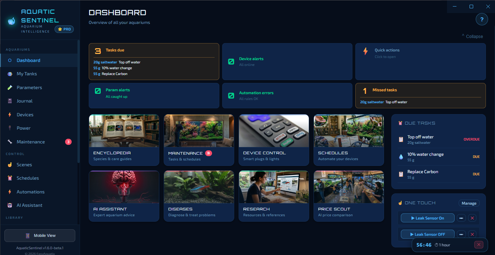
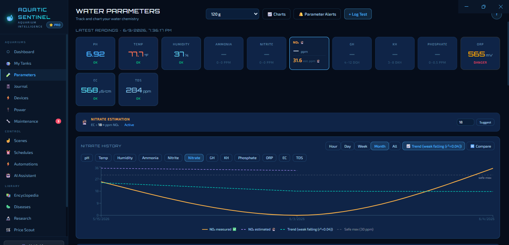
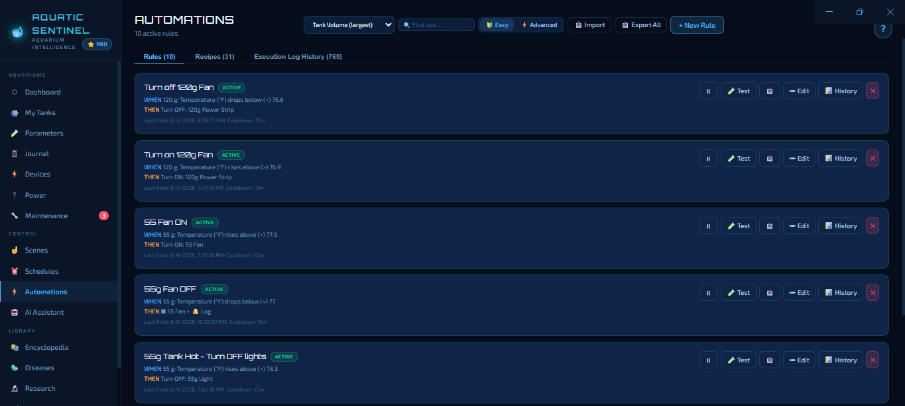

# AquaSentinel

**Intelligent aquarium management for Windows**

AquaSentinel is a full-featured, Windows-based intelligent aquarium management app for maintaining, tracking, and controlling multiple aquariums at once. It was designed by fishkeepers for fishkeepers, with the goal of taking much of the drudgery out of aquarium keeping while making it genuinely affordable. It automates maintenance, surfaces smarter insights, and brings AI-powered features to the hobby that previously cost fishkeepers thousands of dollars — at a fraction of that cost. AquaSentinel itself requires no subscription and stores all your data locally on your own PC. Some advanced features — like Tuya smart device control and the AI assistant — connect to third-party services that have their own accounts, but the core app is yours to use freely.

## Download

### [⬇ Download the latest beta — v1.6.0-beta.3.4](https://github.com/Aquaman-TSH/aquasentinel-releases/releases/tag/v1.6.0-beta.3.4)

All **Pro features are unlocked free** during the beta period.

> **Note:** Windows may show a SmartScreen warning ("Windows protected your PC") because beta builds are not yet code-signed. Click **More info** → **Run anyway**. This will be resolved before the public release.

## Highlights

- **Water quality tracking** — log 13 parameters (pH, temperature, ammonia, nitrite, nitrate, phosphate, GH, KH, salinity, TDS, ORP, calcium, magnesium) with interactive charts and per-tank-type safe-range thresholds
- **Smart device control** — Tuya, Kasa/TP-Link, ESPHome, Govee, and BLE lights and probes, all from one dashboard
- **Automation rules** — visual rule builder for schedules, parameter-triggered actions, and multi-condition logic, no coding required
- **Maintenance & journal** — tasks, feeding logs, medication treatments, and events in one searchable timeline
- **AI assistant** — integrated fish care advice powered by Claude, plus a built-in fish encyclopedia and disease reference
- **Local-first** — all data stored on your own PC, with built-in backup tools

## Screenshots

*More screenshots on the [latest release page](https://github.com/Aquaman-TSH/aquasentinel-releases/releases/tag/v1.6.0-beta.3.4).*

## System requirements

| | |
|---|---|
| OS | Windows 10 or Windows 11 (64-bit) |
| RAM | 4 GB minimum, 8 GB recommended |
| Storage | ~300 MB |
| Network | Required for AI assistant and weather features |

## Beta community

Join the beta Discord to report bugs, request features, and show off your tank:
**[https://discord.gg/6HUqUehk](https://discord.gg/6HUqUehk)**