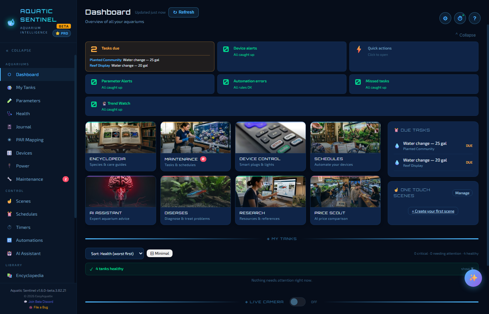
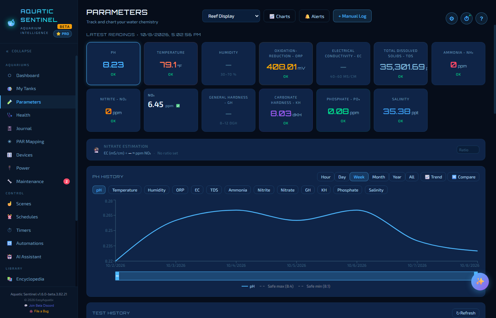
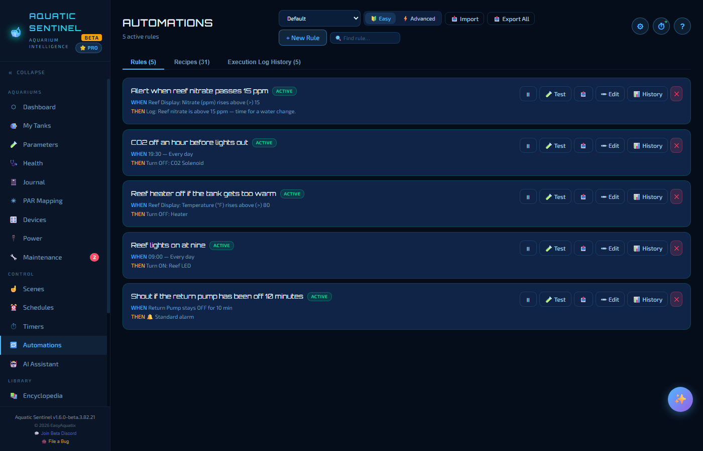

# Aquatic Sentinel

**Intelligent aquarium management for Windows**

Aquatic Sentinel is a full-featured, Windows-based aquarium management app for maintaining, tracking, and controlling multiple aquariums at once. It was designed by fishkeepers for fishkeepers, with the goal of taking much of the drudgery out of aquarium keeping while making it genuinely affordable. It automates maintenance, surfaces smarter insights, and brings AI-powered features to the hobby that previously cost fishkeepers thousands of dollars — at a fraction of that cost. Aquatic Sentinel itself requires no subscription and stores all your data locally on your own PC. Some advanced features — like smart device control and the AI assistant — connect to third-party services that have their own accounts, but the core app is yours to use freely.

## Download

### [⬇ Download the latest beta HERE](https://github.com/Aquaman-TSH/aquasentinel-releases/releases/)

All **Pro features are unlocked free** during the beta period. The app installs and updates itself from then on.

> **Note:** Windows may show a SmartScreen warning ("Windows protected your PC") because beta builds are not yet code-signed. Click **More info** → **Run anyway**. This will be resolved before the public release.

## Highlights

- **Water quality tracking** — log 13 parameters (pH, temperature, ammonia, nitrite, nitrate, phosphate, GH, KH, salinity, TDS, ORP, calcium, magnesium) with interactive charts and per-tank-type safe-range thresholds
- **Smart device control** — Tuya, Kasa / TP-Link, Magic Home, ESPHome and Govee devices, all from one dashboard, with per-outlet locks so a critical heater or pump can't be switched off by accident
- **Zigbee sensors, paired by the app itself** — plug a Zigbee coordinator into your PC and pair supported probes directly. The coordinator is the radio; Aquatic Sentinel drives it, so there is no vendor hub to buy and no separate bridge software to install and keep running
- **PAR mapping** — measure where the light actually lands, section by section, and watch a fixture age before your corals do. Planted-tank targets adjust for whether you inject CO₂
- **See your tanks from anywhere** — a wizard publishes a secure address for your PC, so the app works on your phone away from home. No port forwarding and no router changes
- **A 217-species encyclopedia, built in** — every species ships with a photo and a full care card (temperature and pH range, minimum tank size, adult size, lifespan, diet, temperament, breeding notes, common diseases, compatible tankmates). Link an inhabitant to a species and its care card drives that tank's health benchmarks
- **Tank health scoring that counts your fish** — sick, quarantined or watched livestock caps the score, so a tank can't read "healthy" while its risk badge says otherwise
- **Automation rules** — visual rule builder for schedules, parameter-triggered actions, and multi-condition logic, no coding required
- **Maintenance & journal** — tasks, feeding logs, medication treatments, and events in one searchable timeline
- **AI assistant** — fish care advice, photo diagnosis and fish ID, running on the AI provider you choose: a **free Google Gemini key** covers every feature, and Groq, OpenRouter, Claude and OpenAI are all supported
- **Local-first** — all data stored on your own PC, with built-in backup tools

## Screenshots

*More screenshots on the [latest release page](https://github.com/Aquaman-TSH/aquasentinel-releases/releases/).*

## System requirements

| | |
|---|---|
| OS | Windows 10 or Windows 11 (64-bit) |
| RAM | 4 GB minimum, 8 GB recommended |
| Storage | ~300 MB |
| Network | Required for AI assistant and weather features |

## Beta community

Join the beta Discord to report bugs, request features, and show off your tank:
**[https://discord.gg/AhDD86t4m2](https://discord.gg/AhDD86t4m2)**
